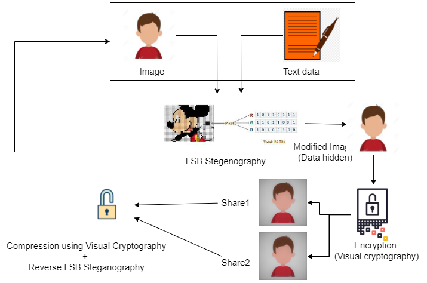

## Advanced Multimedia Obfuscation
### Abstract
The purpose of this project is to enhance the existing method of obscuring msg into multimedia files like images and their secure transmission in unsecure channel.

It is the combination of msg hiding when passed through the network along with the implementation of obfuscation-security. 
The pixels of the images are modified in such a way that it is difficult to apprehend the text hidden in the image. 

In short, our aim is to enhance obfuscation in images subjected to steganography when transmitted or stored.
Steganography is easy to analyze and get the result if we’ve the Image (there is no encryption). 

To counter this given problem we’ve used Visual Cryptography on top of Steganography to make MITM Attack or spoofing more difficult.

### Project Architecture & Structure


#### Project Structure Description
| File          | Description                                               |
|---------------|-----------------------------------------------------------|
| lsb_stegno.py | Methods to Encode and Decode msg using LSB {Steganography} |
| n_share.py    | Methods to Split and Compress LSB Encoded images {Visual-Cryptography}|

### Algorithms
#### Steganography
##### Encoding msg in image

```python
# Embeding modified pixels in the the target image
new_img.putpixel((x, y), pixel)
if (x == w - 1):
    x = 0
    y += 1
else:
    x += 1
```

##### Decoding message from the image
```python
# string of binary message
binstr = ''

for i in pixels[:8]:
    if (i % 2 == 0):
        binstr += '0'
    else:
        binstr += '1'

msg += chr(int(binstr, 2))
if (pixels[-1] % 2 != 0):
    return msg
```
#### Visual Cryptography

##### Generating share images using Visual Cryptography
```python
# Spliting image based on random factor
n = int(np.random.randint(msg[i, j, k] + 1))
img1[i, j, k] = n
img2[i, j, k] = msg[i, j, k] - n
```

##### Compressing share images
```python
img[i, j, k] = img1[i, j, k] + img2[i, j, k]
```

### Dependencies
##### List of dependencies
```
-> numpy==1.14.3
-> Pillow==6.2.2
-> streamlit==0.56.0
```
##### Running our Network Security Project.
```
Run using python
streamlit run main.py
```

